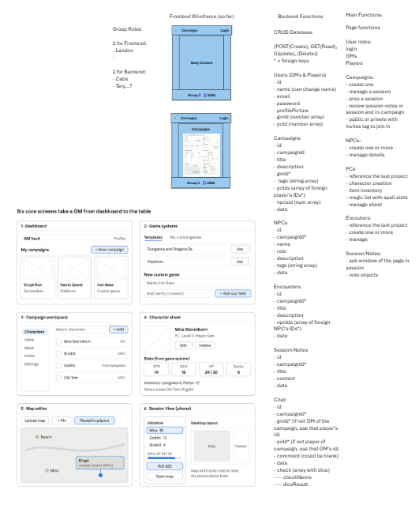

# GM Vault — Feature Plans (Group 3)

These are the implementation plans for the GM Vault MVP. They're based on the **Group 3 whiteboard** (Users, Campaigns, NPCs, Encounters, Session Notes, Chat) and use the GM Vault project spec (Sep 26, 2026) for details like roles, error format and endpoints. Spec features that aren't on the whiteboard (game systems, items, maps, templates from game APIs) are **post-MVP**.

Each plan follows the course template (`_template.md`). Section 11 (AI/ML) is N/A in every plan because no feature uses AI.

## Reference: Group 3 whiteboard



The whiteboard shows:
- **Group roles:** frontend: Landon; backend: Cabe and Tery.
- **Frontend wireframes:** the app shell (header, body, footer) and the Campaigns page.
- **Backend data models (CRUD):** Users, Campaigns, NPCs, Encounters, Session Notes and Chat.
- **Main functions:** what each page needs to do.
- **"Six core screens take a GM from dashboard to the table":** Dashboard, Game systems, Campaign workspace, Character sheet, Map editor and Session View (phone).

## 1. Feature inventory (MVP only)

| ID | Feature | Plan | Type | Severity | Effort |
|---|---|---|---|---|---|
| F1 | Project foundation (app shell, API skeleton, error format, responsive layout) | [F1-project-foundation.md](F1-project-foundation.md) | Infrastructure / supporting | BLOCKER | S |
| F2 | Auth basics (sign up, log in, log out, protected routes) | [F2-auth-basics.md](F2-auth-basics.md) | Blocked by F1 | BLOCKER | S |
| F3 | User profile (name, picture URL, password change, delete account) | [F3-user-profile.md](F3-user-profile.md) | Blocked by F2 | MINOR | S |
| F4 | Campaign CRUD + dashboard | [F4-campaign-crud.md](F4-campaign-crud.md) | Blocked by F2 | BLOCKER | S |
| F5 | Campaign players + role-based access (GM / Player, revealed rule) | [F5-campaign-players-access.md](F5-campaign-players-access.md) | Blocked by F4; infrastructure for F6–F10 | BLOCKER | S |
| F6 | NPC CRUD (with reveal to players) | [F6-npc-crud.md](F6-npc-crud.md) | Blocked by F5 | MAJOR | S |
| F7 | Session notes CRUD (with share to players) | [F7-session-notes.md](F7-session-notes.md) | Blocked by F5 | MAJOR | S |
| F8 | Encounters CRUD (group NPCs, GM only) | [F8-encounters.md](F8-encounters.md) | Blocked by F6 | MAJOR | S |
| F9 | Campaign chat (polling message board) | [F9-campaign-chat.md](F9-campaign-chat.md) | Blocked by F5 | MAJOR | S |
| F10 | Campaign search + dashboard tag filter | [F10-campaign-search.md](F10-campaign-search.md) | Blocked by F6, F7, F8 | MINOR | S |

**How we sliced it:**
- "User system" became three slices: F2 (auth), F3 (profile) and the access half of F5.
- "Responsive design" isn't its own feature. F1 builds the responsive shell, and **every** plan has a responsive section and a 360 px check.
- "Role-based access" (spec feature 9) lives in F5 as shared helpers, so F6–F10 don't each reinvent it.
- Every feature is sized S (about one week for a frontend + backend pair).

## 2. Implementation order

| Order | Feature ID | Depends on | Why this order |
|---|---|---|---|
| 1 | F1-project-foundation | none | Everyone needs the repo, error format, DB connection and shell before anything else. |
| 2 | F2-auth-basics | F1 | Every other route needs a `currentUser`. |
| 3 | F4-campaign-crud | F2 | First full CRUD behind login; the container for all content. |
| 3 (parallel) | F3-user-profile | F2 | Small and independent; the 2nd frontend dev can take it while F4 is built. |
| 4 | F5-campaign-players-access | F4 | Defines GM/Player roles and the "revealed" rule that F6–F10 call. Building content before this means rewriting every permission check. |
| 5 | F6-npc-crud | F5 | Most-used content at the table; F8 and F10 need it. |
| 5 (parallel) | F7-session-notes | F5 | Same pattern as F6, no dependency on it, so a second pair can build it at the same time. |
| 5 (parallel) | F9-campaign-chat | F5 | Only needs membership; independent of content features. |
| 6 | F8-encounters | F6 | Links NPCs, so NPCs must exist (and NPC delete must clean up encounters). |
| 7 | F10-campaign-search | F6, F7, F8 | Searches across all three content types; last because it reads everything. |

**Team split (2 frontend + 2 backend, from the whiteboard):** Weeks 1–2 everyone on F1 → F2. Then two pairs: Pair A does F4 → F5 → F6 → F8; Pair B does F3 → (help on F5 frontend) → F7 → F9. Both pairs share F10.

## 3. Dependency map

```
F1 ──► F2 ──┬──► F3
            └──► F4 ──► F5 ──┬──► F6 ──► F8 ──┐
                             ├──► F7 ─────────┼──► F10
                             └──► F9          │
                                  F6 ─────────┘
```

Cross-feature hooks (a later feature must update an earlier one):
- F6, F7, F8, F9 each add their table to **F4's campaign cascade delete**.
- F8 adds "remove NPC from encounters" to **F6's NPC delete**.
- F5 and F9 add their cleanup steps to **F3's account delete**.

## 4. First feature to implement, and why

**F1 — Project foundation.** It's the only feature with no dependencies, and it fixes the things that are expensive to change later: the error envelope `{ error: { code, message } }`, pagination shape, folder layout, and the responsive app shell from the wireframe. If four people start feature work without it, we'll have four error formats and four layouts. It's time-boxed to about 2 days so F2 can start in week 1.

## 5. Risks that could delay multiple features

| Risk | Features hit | Mitigation |
|---|---|---|
| **Stack not chosen yet** (the spec left it open for the bakeoff) | All | Decide at the bakeoff; plans are written stack-neutral so they don't need rewriting. |
| **Access rules leak** (a player sees a hidden NPC/note/encounter through some route) | F5–F10 | One set of helpers in F5; one shared authz-matrix test file that every feature adds rows to. |
| **`isRevealed` isn't on the whiteboard.** Team may not agree to add it. | F5, F6, F7, F10 | Agree at the next meeting, *before* F6 starts (F5 open question 1). Without it, players see every NPC and note. |
| **Duplicate data on the whiteboard model** (User `gmId[]`/`pcId[]`, Campaign `npcsId[]`, Campaign `campaignId`) | F2, F4, F5, F6 | Decided on review: store each fact once (see §6) and query for the rest. |
| **Cascade deletes miss a table** | F3, F4, F6–F9 | Each plan lists its cascade hook (§3); F4 AC-7 test grows with each feature. |
| **Cookie/session problems between frontend and API origins** | F2 and everything after | Same-origin dev proxy; test login + reload on day 1 of F2. |
| **Chat expected to be real-time** | F9 | Polling is a documented MVP choice; confirm with instructor early. |

## 6. Data model decisions (changes from the whiteboard)

| Whiteboard | Plan | Why |
|---|---|---|
| User `password` | `passwordHash` | Never store plain passwords. |
| User `gmId[]`, `pcId[]` | removed | Same facts as Campaign `gmId` / `playerIds`; two copies drift. Role is per campaign, found by query. |
| Campaign `campaignId` | removed | Duplicate of `id`. |
| Campaign `pcIds` | `playerIds` | Holds user ids, not character ids. |
| Campaign `npcsId[]` | removed | NPC already stores `campaignId`. |
| `date` on Campaign / NPC / Encounter | `createdAt` (+ `updatedAt`) | Server-set timestamps on every model. |
| Session Note `date` | `sessionDate` | The day the session was played, which the GM chooses. |
| — | `isRevealed` on NPC and Session Note | Lets the GM hide spoilers from players (needs team sign-off). |
| Chat `gmId*` / `pcId*` (whichever the sender is), `comment`, `date`, `check { checkName, diceResult }` | `ChatMessage { campaignId, authorId, body }` | One `authorId` replaces the gmId/pcId pair; the sender's role comes from F5. Author name/picture joined at read time. Dice `check` results are post-MVP (Session View). |

## 7. Shared conventions (all plans)

- All API routes under `/api`, JSON only, `requireAuth` on everything except sign-up, log-in and health.
- Errors: `{ error: { code, message, fields? } }` with 400 / 401 / 403 / 404 / 409 / 429 / 500.
- Non-members get **404** (don't reveal that a campaign exists); players trying GM actions get **403 `GM_ONLY`**.
- Lists: `?page=&limit=` → `{ data, page, limit, total }` (chat uses cursors instead; see F9).
- Every UI plan defines loading, empty and error states and works at 360 px.
- Each AC maps to at least one test in that plan's §16 table.

## 8. Post-MVP (from the spec, not planned here)

Game systems and templates from game APIs, items and inventory, maps with pins, Session View (initiative/HP/dice), email invites + live reveal, offline mode, share/export, Spanish localization, password reset by email, image upload, Admin role.

